# MissionSection.vue Implementation Plan

**Design Choice**: Recommendation 3 (Atmospheric Depth Cards) with Deep Teal Background

**Last Updated**: January 2026

---

## Mission & Vision Content (from Profile)

**Mission**: "To secure Asia's palm oil supply through sustainable, scalable operations that deliver consistent quality while protecting Indonesia's forests and communities for future generations."

**Vision**: "To be Asia's most trusted sustainable palm oil partner, setting the industry benchmark for environmental stewardship, operational excellence, and transparent trade."

**Core Values** (5 items):
- Sustainability First — Zero-deforestation commitment, RSPO-certified supply chain, continuous environmental improvement
- Reliable Scale — Consistent annual exports exceeding 500,000 metric tons, dependable year-round supply
- Innovation Driven — Advanced agritech, precision farming, ongoing research and development
- Indonesian Pride — Empowering local communities, creating jobs, advancing national economic growth
- Trade Excellence — Deep market knowledge, trusted Asian partnerships, transparent long-term relationships

---

## Updated Color Scheme: Deep Teal Atmosphere

Following the frontend-design skill's emphasis on distinctive aesthetics and differentiation from other sections, MissionSection will use Deep Teal as the primary background color while maintaining Nusantara Earth palette harmony.

### Color Application

| Element | Color | Hex | Usage |
|---------|-------|-----|-------|
| Section Background | Deep Teal | #2a5c55 | Primary canvas |
| Secondary Background | Dark Coffee | #2c2416 | Secondary elements |
| Accent | Harvest Gold | #d4a24c | Highlights, borders |
| Text Primary | Warm Cream | #f5f0e8 | Main text |
| Text Secondary | Warm Cream | #f5f0e8 at 70% | Secondary text |
| Card Background | White | #ffffff | Card surfaces |
| Card Shadows | Dark Coffee | rgba(44,36,22,0.15) | Depth |
| Mission Border | Harvest Gold | #d4a24c | Accent border |
| Vision Border | Deep Teal | #2a5c55 at 50% | Subtle accent |
| Values Icons | Harvest Gold | #d4a24c | Icon fill |

### Why Deep Teal for MissionSection

1. **Differentiation**: Warm Cream is used in other sections; Deep Teal creates visual distinction
2. **Sustainability Alignment**: Green-teal immediately signals eco-friendly commitment
3. **Trust & Authority**: Deep teal builds credibility with B2B partners
4. **Indonesian Heritage**: Teal appears in traditional Indonesian textiles and art
5. **Premium Feel**: Rich, saturated color elevates the section above typical corporate designs

---

## Design Concept: Atmospheric Depth Cards on Deep Teal

### Visual Treatment

**Background**:
- Base: Deep Teal (#2a5c55) edge-to-edge
- Decorative gradient: Subtle Burnt Sienna to transparent at 8% opacity, positioned at upper left
- Subtle texture: Very fine noise overlay at 1% for tactile depth

**Mission Card (Upper layer)**:
- Background: White with 0.98 opacity for subtle warmth
- Border: 1px solid rgba(212, 162, 76, 0.4)
- Border-radius: 0px (industrial feel, matching brand)
- Shadow: `0 25px 80px rgba(44, 36, 22, 0.18)` for dramatic lift
- Padding: 48px
- Label: "Mission" in uppercase, 11px, Deep Teal, 0.25em tracking, background pill in Warm Cream
- Text: 22px italic serif (Playfair Display), Dark Coffee, max-width 90%
- Accent: 6px solid Harvest Gold left edge

**Vision Card (Middle layer, offset)**:
- Position: Shifted right by 60px and down by 30px from mission card
- Background: White with 0.95 opacity
- Border: 1px solid rgba(42, 92, 85, 0.3)
- Shadow: `0 20px 70px rgba(44, 36, 22, 0.12)`
- Padding: 40px
- Label: "Vision" in uppercase, 11px, Burnt Sienna, 0.25em tracking, background pill in Warm Cream
- Text: 18px regular sans (Jakarta Sans), Dark Coffee at 75%, max-width 95%
- Decorative: Large quotation mark SVG in Deep Teal at 10% opacity behind text

**Values Grid (Lower layer)**:
- 5 cards in 3+2 responsive grid arrangement
- Card background: White with 0.9 opacity
- Card border: 1px solid rgba(212, 162, 76, 0.2)
- Hover effect: Background brightens to white, border becomes Harvest Gold
- Icon size: 36px in Harvest Gold
- Text: 13px, Dark Coffee, centered below icon
- Spacing: 24px gap between cards

**Right-side Atmospheric Element**:
- Full-height 30% width, positioned at right edge
- Background: Dark Coffee (#2c2416) gradient to transparent
- Unsplash image: Sunrise plantation silhouette at 15% opacity
- Overlay: Burnt Sienna gradient at 5% for warmth
- Foreground: Single stylized oil palm frond SVG silhouette, Gold at 20%

### Typography Scale

| Element | Desktop | Mobile | Weight | Font Family |
|---------|---------|--------|--------|-------------|
| Section Label | 11px | 10px | uppercase, 0.25em | Jakarta Sans |
| Title | 64px | 36px | Bold, -0.02em | Jakarta Sans |
| Mission Text | 22px | 18px | Italic | Playfair Display |
| Vision Text | 18px | 16px | Regular | Jakarta Sans |
| Values Text | 13px | 12px | Medium | Jakarta Sans |
| Quotation Mark | 120px | 80px | Italic | Playfair Display |

### Animation Strategy

**On Mount**:
- Mission card: Fade in + translateY from 30px, duration 0.8s
- Vision card: Fade in + translateY from 40px, duration 0.8s, delay 0.2s
- Values grid: Staggered fade in, 0.1s between items, delay 0.4s

**On Scroll** (ScrollTrigger):
- Floating oscillation: Gentle translateY between -4px and +4px, duration 6s, ease: sine
- Hover effects: Scale 1.02, shadow increase on values cards
- Parallax: Subtle translateX on atmospheric element during scroll

**Reduced Motion**:
- Disable oscillation animation
- Reduce reveal duration to 0.3s maximum
- Maintain all content visibility

---

## Unsplash Image Selection

**Primary Image**: Sunrise plantation silhouette
- Keywords: "Indonesia palm oil plantation sunrise aerial mist"
- Characteristics: Warm golden tones, misty atmosphere, silhouetted landscape
- Recommended ID: `photo-1548560468-e3236e1a7296` (Indonesian sunrise plantation)

**Image Treatment**:
- Position: Right edge, 30% width, full-height
- Opacity: 15% (subtle atmospheric presence)
- Blur: 2px for depth integration
- Overlay: Burnt Sienna gradient at 5% for warmth

---

## SVG Elements

### Oil Palm Frond Silhouette

Custom inline SVG element positioned as foreground accent:

```svg
<svg viewBox="0 0 200 200" class="palm-frond">
  <path d="M100 180 Q80 120 60 80 Q50 60 40 30 Q45 50 60 70 Q80 100 100 160 Q120 100 140 70 Q155 50 160 30 Q150 60 140 80 Q120 120 100 180Z" 
        fill="currentColor" opacity="0.2"/>
</svg>
```

### Quotation Mark

Large decorative SVG behind vision text:

```svg
<svg viewBox="0 0 100 80" class="quotation-mark">
  <text x="0" y="60" font-size="80" font-family="Georgia, serif" fill="#2a5c55" opacity="0.1">"</text>
</svg>
```

---

## Component Structure

```vue
<script setup lang="ts">
import { useNuxtApp } from '#app'

const { $gsap } = useNuxtApp()

onMounted(() => {
  const shouldReduceMotion = window.matchMedia('(prefers-reduced-motion: reduce)').matches
  
  if (shouldReduceMotion) {
    $gsap.set(['.mission-card', '.vision-card', '.value-card'], { opacity: 1, y: 0 })
    return
  }
  
  // Floating animation
  $gsap.to('.mission-card', {
    y: -6,
    duration: 4,
    repeat: -1,
    yoyo: true,
    ease: 'sine.inOut'
  })
  
  // Scroll-triggered reveals
  $gsap.from('.mission-card', {
    opacity: 0,
    y: 30,
    duration: 0.8,
    scrollTrigger: { trigger: '#mission', start: 'top 70%' }
  })
  
  $gsap.from('.vision-card', {
    opacity: 0,
    y: 40,
    duration: 0.8,
    delay: 0.2,
    scrollTrigger: { trigger: '#mission', start: 'top 70%' }
  })
  
  $gsap.from('.value-card', {
    opacity: 0,
    y: 20,
    duration: 0.5,
    stagger: 0.1,
    delay: 0.4,
    scrollTrigger: { trigger: '.values-grid', start: 'top 75%' }
  })
})

const missionText = "To secure Asia's palm oil supply through sustainable, scalable operations that deliver consistent quality while protecting Indonesia's forests and communities for future generations."

const visionText = "To be Asia's most trusted sustainable palm oil partner, setting the industry benchmark for environmental stewardship, operational excellence, and transparent trade."

const values = [
  { id: 'sustainability', label: 'Sustainability First' },
  { id: 'scale', label: 'Reliable Scale' },
  { id: 'innovation', label: 'Innovation Driven' },
  { id: 'pride', label: 'Indonesian Pride' },
  { id: 'excellence', label: 'Trade Excellence' }
]
</script>

<template>
  <section id="mission" class="mission-section">
    <!-- Atmospheric background -->
    <div class="mission-bg"></div>
    <div class="mission-gradient"></div>
    
    <!-- Main content container -->
    <div class="mission-content">
      <!-- Section title -->
      <h2 class="mission-title">Mission & Vision</h2>
      
      <!-- Mission card -->
      <div class="mission-card">
        <span class="card-label">Mission</span>
        <blockquote class="mission-quote">
          {{ missionText }}
        </blockquote>
      </div>
      
      <!-- Vision card -->
      <div class="vision-card">
        <span class="card-label">Vision</span>
        <p class="vision-text">{{ visionText }}</p>
        <svg class="quotation-mark" viewBox="0 0 100 80">
          <text x="0" y="60" font-size="80" font-family="Georgia, serif">"</text>
        </svg>
      </div>
      
      <!-- Values grid -->
      <div class="values-grid">
        <div v-for="value in values" :key="value.id" class="value-card">
          <span class="value-label">{{ value.label }}</span>
        </div>
      </div>
    </div>
    
    <!-- Right atmospheric panel -->
    <div class="mission-atmosphere">
      
      <svg class="palm-frond" viewBox="0 0 200 200">
        <path d="M100 180 Q80 120 60 80 Q50 60 40 30 Q45 50 60 70 Q80 100 100 160 Q120 100 140 70 Q155 50 160 30 Q150 60 140 80 Q120 120 100 180Z" 
              fill="currentColor"/>
      </svg>
    </div>
  </section>
</template>

<style scoped>
.mission-section {
  position: relative;
  min-height: 100vh;
  background: #2a5c55;
  overflow: hidden;
  display: flex;
}

.mission-bg {
  position: absolute;
  inset: 0;
  background: #2a5c55;
}

.mission-gradient {
  position: absolute;
  top: 0;
  left: 0;
  width: 60%;
  height: 40%;
  background: linear-gradient(135deg, #c45b28 0%, transparent 70%);
  opacity: 0.08;
}

.mission-content {
  position: relative;
  z-index: 10;
  flex: 1;
  padding: 80px 60px;
  display: flex;
  flex-direction: column;
  gap: 40px;
}

.mission-title {
  font-size: 64px;
  font-weight: 700;
  color: #f5f0e8;
  letter-spacing: -0.02em;
}

.mission-card,
.vision-card {
  background: rgba(255, 255, 255, 0.95);
  padding: 48px 40px;
  box-shadow: 0 25px 80px rgba(44, 36, 22, 0.18);
}

.mission-card {
  border-left: 6px solid #d4a24c;
  max-width: 700px;
}

.vision-card {
  border: 1px solid rgba(42, 92, 85, 0.3);
  max-width: 650px;
  margin-left: 60px;
}

.card-label {
  display: inline-block;
  padding: 6px 16px;
  background: #f5f0e8;
  color: #2a5c55;
  font-size: 11px;
  font-weight: 600;
  letter-spacing: 0.25em;
  text-transform: uppercase;
  margin-bottom: 24px;
}

.mission-quote {
  font-family: 'Playfair Display', Georgia, serif;
  font-size: 22px;
  font-style: italic;
  color: #2c2416;
  line-height: 1.6;
}

.vision-text {
  font-family: 'Jakarta Sans', sans-serif;
  font-size: 18px;
  color: rgba(44, 36, 22, 0.75);
  line-height: 1.8;
}

.values-grid {
  display: grid;
  grid-template-columns: repeat(5, 1fr);
  gap: 24px;
  max-width: 800px;
  margin-top: 20px;
}

.value-card {
  background: rgba(255, 255, 255, 0.9);
  padding: 24px 16px;
  text-align: center;
  border: 1px solid rgba(212, 162, 76, 0.2);
  transition: all 0.3s ease;
}

.value-card:hover {
  background: #ffffff;
  border-color: #d4a24c;
  transform: translateY(-4px);
}

.value-label {
  font-family: 'Jakarta Sans', sans-serif;
  font-size: 13px;
  font-weight: 500;
  color: #2c2416;
}

.mission-atmosphere {
  position: relative;
  width: 30%;
  height: 100%;
  background: linear-gradient(to left, #2c2416, transparent);
}

.atmosphere-image {
  position: absolute;
  inset: 0;
  width: 100%;
  height: 100%;
  object-fit: cover;
  opacity: 0.15;
  filter: blur(2px);
}

.palm-frond {
  position: absolute;
  bottom: 0;
  right: 20%;
  width: 180px;
  height: 180px;
  color: #d4a24c;
  opacity: 0.2;
}

.quotation-mark {
  position: absolute;
  top: 20px;
  right: 30px;
  width: 80px;
  height: 60px;
  color: #2a5c55;
  opacity: 0.1;
}

@media (max-width: 1024px) {
  .mission-content {
    padding: 60px 40px;
  }
  
  .mission-title {
    font-size: 48px;
  }
  
  .vision-card {
    margin-left: 0;
  }
  
  .values-grid {
    grid-template-columns: repeat(3, 1fr);
  }
}

@media (max-width: 768px) {
  .mission-section {
    flex-direction: column;
  }
  
  .mission-content {
    padding: 48px 24px;
  }
  
  .mission-title {
    font-size: 36px;
  }
  
  .mission-card,
  .vision-card {
    padding: 32px 24px;
  }
  
  .mission-quote {
    font-size: 18px;
  }
  
  .values-grid {
    grid-template-columns: repeat(2, 1fr);
  }
  
  .mission-atmosphere {
    width: 100%;
    height: 30vh;
  }
}
</style>
```

---

## Data Structure

```typescript
interface MissionSectionContent {
  mission: {
    label: string
    text: string
  }
  vision: {
    label: string
    text: string
  }
  values: Array<{
    id: string
    label: string
  }>
}

const missionContent: MissionSectionContent = {
  mission: {
    label: 'Mission',
    text: 'To secure Asia\'s palm oil supply through sustainable, scalable operations that deliver consistent quality while protecting Indonesia\'s forests and communities for future generations.'
  },
  vision: {
    label: 'Vision',
    text: 'To be Asia\'s most trusted sustainable palm oil partner, setting the industry benchmark for environmental stewardship, operational excellence, and transparent trade.'
  },
  values: [
    { id: 'sustainability', label: 'Sustainability First' },
    { id: 'scale', label: 'Reliable Scale' },
    { id: 'innovation', label: 'Innovation Driven' },
    { id: 'pride', label: 'Indonesian Pride' },
    { id: 'excellence', label: 'Trade Excellence' }
  ]
}
```

---

## Function Reuse Strategy

**Existing Components to Reuse**:
- `IconAccent.vue` for value icons (or create new SVG icons)
- GSAP animation pattern from StatsSection (`scrollTrigger` with viewport percentage)
- Color variables from CSS custom properties
- Responsive breakpoint system from existing sections
- Typography scale matching existing section patterns

**New Components Required**:
- Oil palm frond SVG (inline, no component)
- Quotation mark SVG (inline, no component)

---

## Mermaid Component Flow

```mermaid
flowchart TD
    A[MissionSection.vue] --> B[Background Layer]
    A --> C[Content Layer]
    A --> D[Atmosphere Layer]
    
    B --> B1[Deep Teal Base #2a5c55]
    B --> B2[Burnt Sienna Gradient 8%]
    B --> B3[Noise Texture 1%]
    
    C --> C1[Section Title]
    C --> C2[Mission Card]
    C --> C3[Vision Card]
    C --> C4[Values Grid]
    
    C2 --> C2a[Label: Mission]
    C2 --> C2b[Blockquote: Playfair Display italic]
    C2 --> C2c[6px Gold Left Border]
    
    C3 --> C3a[Label: Vision]
    C3 --> C3b[Statement: Jakarta Sans]
    C3 --> C3c[Quotation Mark SVG]
    
    C4 --> C4a[5 Value Cards]
    C4 --> C4b[Gold Icons]
    C4 --> C4c[Dark Coffee Labels]
    
    D --> D1[Dark Coffee Gradient]
    D --> D2[Blurred Unsplash 15%]
    D --> D3[Palm Frond SVG 20%]
    
    style A fill:#2a5c55,stroke:#f5f0e8,stroke-width:2px
    style C2 fill:#ffffff,stroke:#d4a24c,stroke-width:3px
    style C3 fill:#ffffff,stroke:#2a5c55,stroke-width:1px
    style D fill:#2c2416,stroke:#2c2416,stroke-width:0px
```



---

## Acceptance Criteria

**AC-1**: Given MissionSection is rendered, When viewed on desktop, Then it displays a full-width 100vh section with Deep Teal background and subtle Burnt Sienna gradient.

**AC-2**: Given MissionSection displays mission card, When examined, Then it shows "Mission" label in uppercase 11px Deep Teal on Warm Cream pill background with 22px italic serif mission text and 6px Harvest Gold left border.

**AC-3**: Given MissionSection displays vision card, When examined, Then it shows "Vision" label in uppercase 11px Burnt Sienna on Warm Cream pill background with 18px regular sans-serif vision text positioned offset from mission card.

**AC-4**: Given MissionSection displays values, When examined, Then all 5 core values appear in a 5-column grid with Harvest Gold icons and Dark Coffee labels.

**AC-5**: Given MissionSection is viewed, When the page loads, Then cards float with gentle vertical oscillation animation (disabled for reduced motion).

**AC-6**: Given MissionSection uses Deep Teal background, When inspected, Then all elements use Nusantara Earth colors: Deep Teal (#2a5c55), Harvest Gold (#d4a24c), Warm Cream (#f5f0e8), Dark Coffee (#2c2416).

**AC-7**: Given MissionSection is viewed on mobile, When screen width is below 1024px, Then layout adjusts: title 48px, cards stack vertically, values grid becomes 3 columns, atmosphere panel becomes 30vh height.

**AC-8**: Given MissionSection right panel, When examined, Then it shows Dark Coffee gradient with blurred Unsplash plantation image at 15% opacity and palm frond SVG silhouette at 20% Gold opacity.

**AC-9**: Given the user scrolls to MissionSection, When animation triggers, Then GSAP reveals elements with staggered timing following reduced-motion preference detection.

**AC-10**: Given MissionSection values cards are hovered, When examined, Then cards lift 4px with border color changing to Harvest Gold and background brightening to white.

---

## Edge Cases

**Image Loading Failure**:
- Add `@error` handler to hide image and show fallback gradient
- Ensure palm frond SVG renders as visual anchor
- Provide fallback Deep Teal solid background

**Reduced Motion Preference**:
- Detect `prefers-reduced-motion: reduce` via media query
- Disable floating oscillation animation entirely
- Keep reveal animations with reduced duration (0.3s maximum)
- Maintain all layout and content visibility

**Mobile Viewport Heights**:
- Use `dvh` units with `svh` fallback for true viewport height
- Ensure cards don't overflow on iOS Safari with dynamic toolbars
- Test with browser chrome showing/hiding during scroll

**Content Overflow**:
- Set max-width on mission blockquote to 80 characters for readability
- Enable text wrapping on values labels
- Add vertical scroll if values grid exceeds viewport on very small screens

**Concurrent Section Animations**:
- Use GSAP `ScrollTrigger` with proper cleanup in `onUnmounted`
- Set distinct trigger points to prevent animation conflicts
- Use `will-change: transform` sparingly only on animated elements

**Card Overlap on Small Screens**:
- Ensure minimum 20px gap between mission and vision cards at all viewports
- Add responsive breakpoint at 1200px to reduce card offset
- Test hover states work when cards are closer together

---

## Verification Checklist

- [ ] Component renders with 100vh height on desktop
- [ ] Deep Teal background displays correctly with gradient overlay
- [ ] Mission card shows correct text with 6px gold left border
- [ ] Vision card shows correct text with quotation mark SVG
- [ ] All 5 core values display with gold icons and dark coffee labels
- [ ] Unsplash image loads with proper blur and 15% opacity
- [ ] Palm frond SVG renders correctly at 20% Gold opacity
- [ ] GSAP floating animation activates on load
- [ ] Scroll-triggered reveals work correctly
- [ ] Reduced motion preference respected
- [ ] Mobile responsive stack works at 1024px and 768px breakpoints
- [ ] All colors match Nusantara Earth palette
- [ ] `bun run lint` passes without errors
- [ ] `bun run build` completes successfully
- [ ] Accessibility: Alt text present on images
- [ ] Accessibility: Color contrast meets WCAG AA

---

## Todo List

- [x] Create 4 design recommendations for MissionSection.vue
- [x] Select recommended design approach (Atmospheric Depth Cards)
- [x] Update color scheme to Deep Teal background
- [ ] Implement MissionSection.vue with chosen design
- [ ] Add Unsplash images and SVG elements
- [ ] Implement GSAP animations
- [ ] Add responsive styles
- [ ] Run lint and build verification
